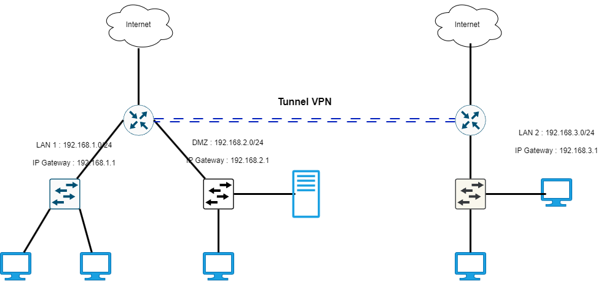
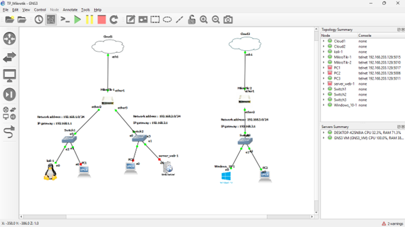
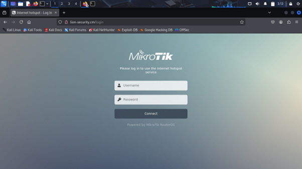
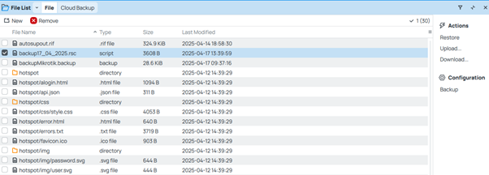

# 🌐 Technologie MikroTik – Mise en œuvre réseau avec GNS3

Ce projet présente l’implémentation et la configuration de plusieurs fonctionnalités réseau avancées à l’aide de routeurs **MikroTik**, dans un environnement de simulation **GNS3**. Il s’inscrit dans le cadre d’un travail pratique ayant pour objectif de maîtriser la gestion réseau en entreprise.

---

## 🚀 Objectifs

- Apprendre à simuler un réseau d’entreprise
- Manipuler les interfaces CLI et GUI de MikroTik
- Comprendre les concepts fondamentaux : routage, sécurité, VPN
- Savoir déployer une architecture sécurisée et stable

---

## 🧰 Technologies utilisées

- **MikroTik RouterOS**
- **Winbox** (interface graphique)
- **GNS3** (simulateur réseau)
- **Machines virtuelles** (Kali Linux, PC)

---

## 🧱 Architecture du projet

Deux sites géographiques (Bafoussam et Yaoundé) sont interconnectés via un **VPN site-to-site**. Chaque site comprend :

- Un **routeur MikroTik**
- Un réseau local (**LAN**)
- Une **DMZ** (avec serveurs pour le site 1)
- Connexion à Internet via un **cloud simulé**

Son implementation dans gns3 est le suivant : 

---

## ⚙️ Fonctionnalités implémentées

### 1. Services réseau de base

- **Bridge** : pour mettre plusieurs interfaces sur un même réseau
- **DHCP Server** : adressage IP automatique
- **DNS Client** : résolution de noms
- **NAT** : accès Internet depuis le réseau privé

### 2. Fonctionnalités avancées

- 🔥 **Firewall** : création de règles de sécurité (ex. : restreindre l'accès SSH)
- 🚦 **QoS (Simple Queues)** : gestion de la bande passante par poste
- 🌐 **Hotspot** :
  - Portail captif avec authentification utilisateur
  - Profils personnalisés (étudiants, enseignants)
- 🔐 **VPN IPsec (Site-to-Site)** :
  - Tunnel sécurisé entre les deux sites
  - Configuration de Proposals, Peers, Policies

### 3. Administration réseau

- 👥 **Gestion des utilisateurs & groupes**
- 💾 **Sauvegarde & restauration** :
  - Par fichier `.backup` ou script `.rsc`
- 🚫 **Filtrage de sites web** :
  - Exemple : blocage de YouTube via Hotspot/Walled Garden

---

## 📸 Captures d'écran

> Des captures sont disponibles dans le rapport PDF : configuration DHCP, DNS, NAT, firewall, Hotspot, VPN, etc.

Voici quelques unes :

- Hotspot

- Restauration des configurations

- Blocage du site www.youtube.com

---

## 📚 Références

- [https://mikrotik.com/](https://mikrotik.com/)
- [Winbox Download](https://winbox.en.softonic.com/)
- Rapport : *TP Technologie MikroTik – 2024/2025*

---

> 💡 **N'hésitez pas à forker ce dépôt ou à l'utiliser comme base pour vos propres labs MikroTik !**

